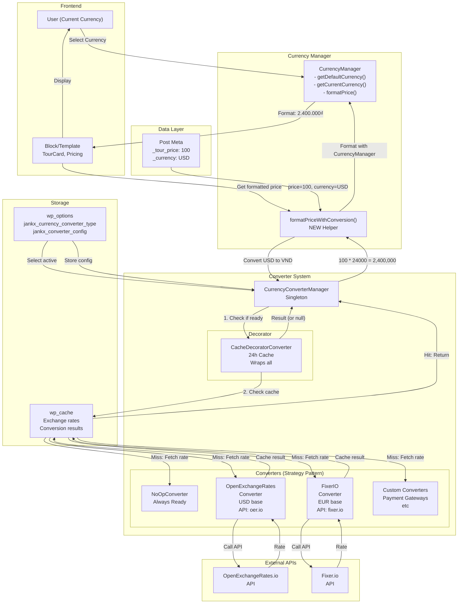
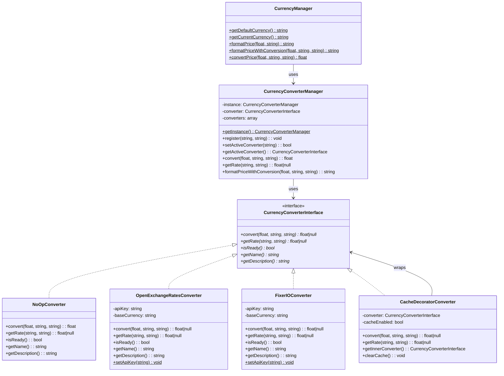
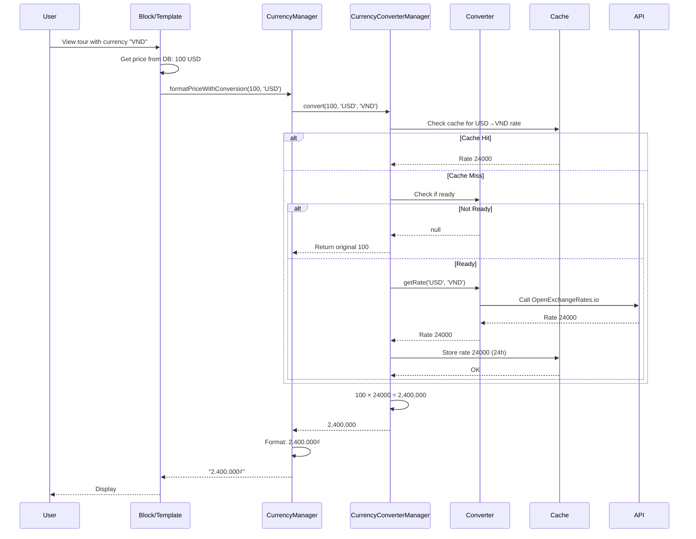
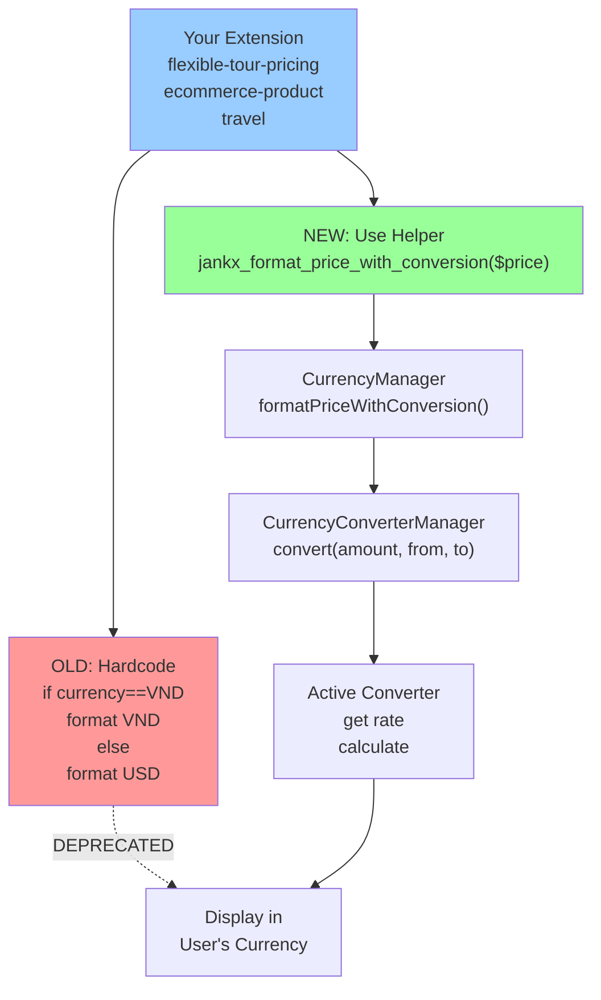
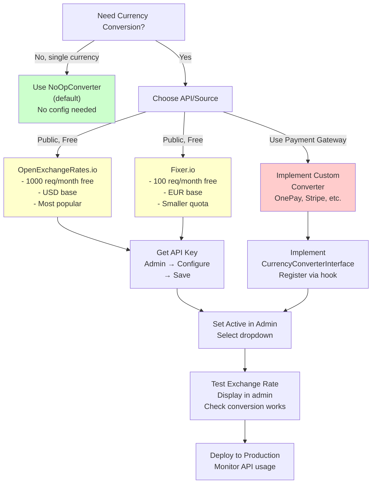

# Currency Conversion System - Visual Architecture

## System Flow Diagram



## Class Diagram



## Data Flow Diagram



## File Structure

```
base-ecommerce/
├── src/Currency/
│   ├── CurrencyManager.php (UPDATED)
│   │   ├── formatPriceWithConversion() [NEW]
│   │   └── convertPrice() [NEW]
│   │
│   ├── Converters/
│   │   ├── CurrencyConverterInterface.php [NEW]
│   │   ├── CurrencyConverterManager.php [NEW]
│   │   ├── NoOpConverter.php [NEW]
│   │   ├── OpenExchangeRatesConverter.php [NEW]
│   │   ├── FixerIOConverter.php [NEW]
│   │   └── CacheDecoratorConverter.php [NEW]
│   │
│   ├── Admin/
│   │   └── ConverterSettingsPage.php [NEW]
│   │
│   └── helpers.php [NEW]
│       ├── jankx_format_price_with_conversion()
│       ├── jankx_convert_price()
│       ├── jankx_get_converter_manager()
│       └── ... more helpers
│
├── CURRENCY_CONVERSION_GUIDE.md [NEW]
├── CURRENCY_CONVERSION_INTEGRATION.md [NEW]
├── CURRENCY_CONVERSION_SUMMARY.md [NEW]
└── CURRENCY_CONVERSION_EXAMPLES.php [NEW]

travel/src/Blocks/
└── PostStartingPriceBlock.php (UPDATED)
    └── Uses CurrencyManager::formatPriceWithConversion()
```

## Configuration Flow

```mermaid
graph LR
    Admin["Admin Panel<br/>Ecommerce → Currency"]
    Select["1. Select Converter<br/>nopp | openexchangerates<br/>| fixerio | custom"]
    Config["2. Configure<br/>API Key<br/>Base Currency"]
    Store["3. Store in DB<br/>wp_options<br/>jankx_currency_converter_type<br/>jankx_converter_config"]
    Manager["4. Load in Manager<br/>CurrencyConverterManager<br/>getInstance()"]
    Active["5. Active Converter<br/>Wrapped with<br/>CacheDecoratorConverter"]
    Ready["6. Ready to Use<br/>formatPriceWithConversion()<br/>convertPrice()"]

    Admin -->|Select| Select
    Select -->|Add details| Config
    Config -->|Save| Store
    Store -->|Init| Manager
    Manager -->|Set| Active
    Active -->|Use| Ready
```



## Extension Integration Pattern



## Converter Selection Decision Tree



---

## Key Points

1. **Strategy Pattern** - Multiple converter implementations, easy to swap
2. **Decorator Pattern** - Caching automatically applied
3. **Singleton Pattern** - One manager instance per request
4. **Fail-safe** - No conversion = show original price
5. **Extensible** - Add custom converters without modifying core
6. **Performant** - 24h rate caching, per-request conversion caching
7. **Backward Compatible** - Old code still works
